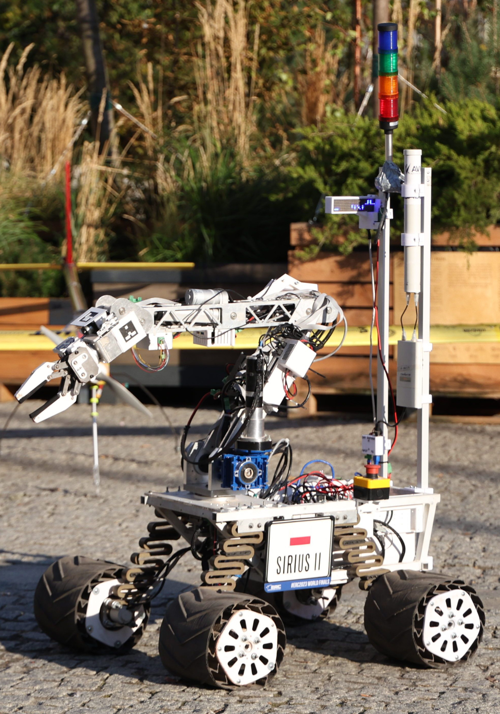
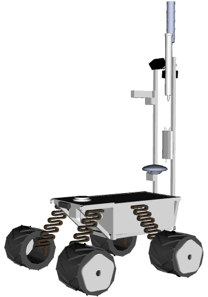
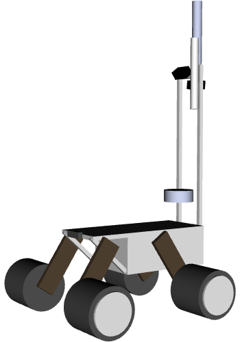

# sirius_description package
Description of the Sirius hardware. 
## URDF
- `sirius.urdf.xacro`  
    Sirius 2 model  
    In order to generate urdf file run:
    ```bash
    $ roscd sirius_description/urdf/
    $ xacro sirius.urdf.xacro -o sirius.urdf
    ```

<table>
  <thead>
    <tr>
      <th width="500px">Prawdziwy robot <br /> (Olgierd Skromak 2023)</th>
      <th width="500px">Model wizualny</th>
      <th width="500px">Model kolizyjny</th>
    </tr>
  </thead>
</table>
<table>
  <thead>
    <tr>
      <th width="500px"></th>
      <th width="500px"></th>
      <th width="500px"></th>
    </tr>
  </thead>
</table>